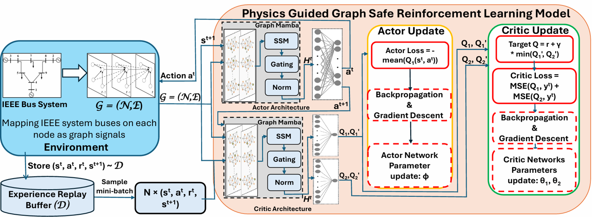
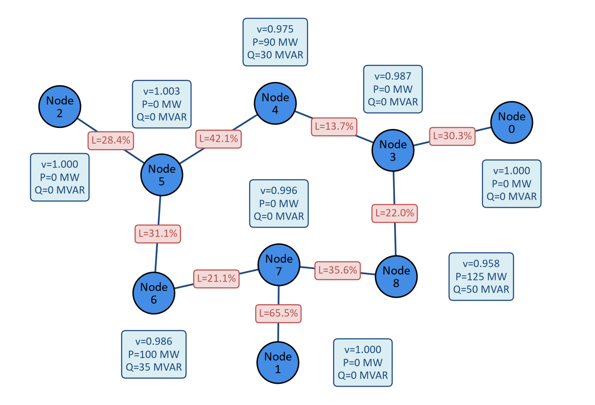
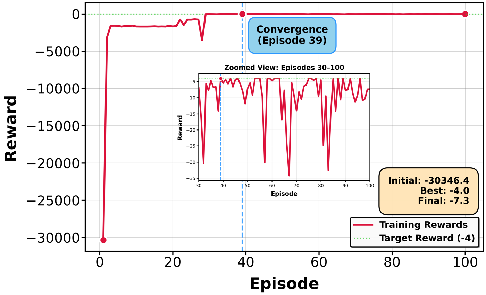
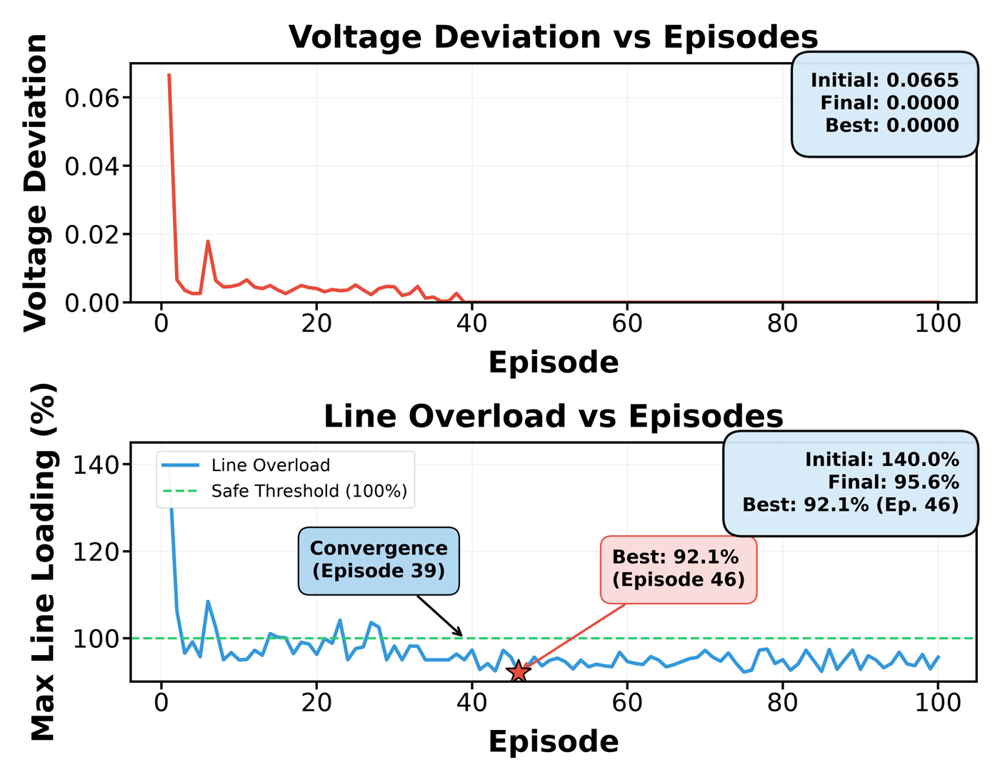

# PGSRL — Physics-Guided Graph Safe Reinforcement Learning for AC-OPF

**Graph Mamba encoder · Constrained MDP · Twin Delayed DDPG · Physics-guided reward · AC power flow in the loop**

[](https://www.python.org/)
[](https://pytorch.org/)
[](https://www.pandapower.org/)
[](LICENSE)

PGSRL solves the alternating current optimal power flow (AC-OPF) problem with a safe
reinforcement learning agent that acts directly on a graph representation of the network.
A Graph Mamba encoder maps each grid snapshot to a compact state, a TD3 actor–critic
proposes generator setpoints in a continuous action space, and voltage and thermal limits
enter the reward as physics-guided penalty terms. The AC power flow is solved at every
step, so each state the agent visits is a physically consistent operating point.

<p align="center">
  
</p>

## Method at a glance

| Stage | Component | What it does |
|---|---|---|
| **Environment** | `ACOPFEnv` | Wraps a pandapower benchmark network. Applies the proposed setpoints at the generator (PV) buses, solves the AC power flow, returns the new operating point. Terminates the episode on a voltage or thermal violation, or on power-flow divergence. |
| **State** | `_get_graph_representation` | Builds the graph: each bus carries voltage magnitude and active/reactive load, each line carries resistance and reactance. State dimension is 3 x the number of buses. |
| **Encoder** | `GraphMambaConv` | Spectral graph convolution with a gating mechanism, producing the compact representation consumed by both actor and critic. |
| **Policy** | `GNNActor` / `GNNCritic` | Deterministic actor outputting normalized setpoints in [−1, 1], scaled to the generator limits; twin critics for value estimation. |
| **Agent** | `TD3Agent` | Twin critics, delayed policy updates, target-policy smoothing, soft target updates, replay buffer. |
| **Reward** | `_compute_reward` | Negative quadratic generation cost, minus λ₁ · voltage deviation and λ₂ · line-flow overload (Eqs. 17–20 of the paper). |

<p align="center">
  
</p>
<p align="center"><em>Graph representation of the IEEE 9-bus system: bus measurements as node features, line impedances as edge features.</em></p>

## Repository layout

```text
PG2RL/
├── src/
│   ├── train_pgsrl.py           # ACOPFEnv + GraphMambaConv + TD3Agent; training,
│   │                            #   per-setpoint MAPE vs the AC-OPF reference,
│   │                            #   MFLOPs measurement, Gaussian-noise robustness
│   ├── ablation_study.py        # five architectural variants under identical settings
│   └── contingency_analysis.py  # post-training N-1 outages and 24 h RTS-96 demand profile
├── configs/
│   └── pgsrl_default.yaml       # every hyperparameter reported in the paper
├── assets/                      # figures used in this README
├── requirements.txt             # pinned to the versions used for the reported runs
├── CITATION.cff
├── LICENSE                      # MIT
└── README.md
```

Each script is self-contained and selects its benchmark system at the top of the file —
there is no shared configuration module to wire up.

## Installation

```bash
git clone https://github.com/SaffariPNWMINDs/PG2RL.git
cd PG2RL
python -m venv .venv && source .venv/bin/activate     # Windows: .venv\Scripts\activate
pip install -r requirements.txt
```

Python 3.10 is recommended. A CUDA-capable GPU is optional; the reported runs used an
NVIDIA RTX 3060 Ti.

## Quick start

```bash
python src/train_pgsrl.py            # train the agent and report MAPE for Pg, Qg and V
```

The run prints the per-episode reward and the MAPE of each setpoint type against the
AC-OPF reference obtained from pandapower's `runopp`.

## Running the experiments

```bash
python src/train_pgsrl.py            # training, setpoint accuracy, MFLOPs, noise robustness
python src/ablation_study.py         # full / GCN-only / no-gating / cost-only / single-critic
python src/contingency_analysis.py   # N-1 line outages and the RTS-96 24 h demand profile
```

| Script | Produces | Related paper content |
|---|---|---|
| `train_pgsrl.py` | MAPE of `Pg`, `Qg`, `V` against the AC-OPF reference; inference cost in MFLOPs; MAPE under Gaussian input noise | Tables 3 and 5, Figure 10 |
| `ablation_study.py` | MAPE for each architectural variant | Table 8 |
| `contingency_analysis.py` | Convergence, bus voltages and line loadings per outage; hourly generation cost against the MATPOWER optimum | Table 6, Figure 11 |

## Benchmarks & provenance

All networks come from `pandapower.networks`; no external dataset is required.

| System | Loader | Buses / Generators / Loads |
|---|---|---|
| IEEE 9-bus | `pn.case9()` | 9 / 3 / 3 |
| IEEE 39-bus | `pn.case39()` | 39 / 10 / 21 |
| IEEE 89-bus | `pn.case89pegase()` | 89 / 12 / 29 |
| IEEE 118-bus | `pn.case118()` | 118 / 54 / 99 |
| IEEE 300-bus | `pn.case300()` | 300 / 69 / 201 |
| PEGASE 1354-bus | `pn.case1354pegase()` | 1354 / 260 / 673 |

Reference setpoints are produced by pandapower's AC-OPF solver (`runopp`) on each network.

## Results

The tables and figures below are the results reported in the paper, reproduced here for
reference. See the paper for the full experimental setup and discussion.

### Accuracy and inference cost

Aggregated MAPE (%) over `Pg`, `Qg` and `V`, with inference cost in MFLOPs.

| Method | 9-bus | 39-bus | 89-bus | 118-bus | 300-bus | PEGASE 1354 |
|---|---|---|---|---|---|---|
| NN-OPF | 5.70 / 0.20 | 5.95 / 0.35 | 6.27 / 0.87 | 6.38 / 1.03 | 6.67 / 1.39 | 9.17 / 11.48 |
| DeepOPF | 5.46 / 0.34 | 5.70 / 0.91 | 5.89 / 1.99 | 5.92 / 2.43 | 6.02 / 2.89 | 8.57 / 13.77 |
| SELM | 5.28 / 0.29 | 5.53 / 0.98 | 5.36 / 1.78 | 5.51 / 3.50 | 5.94 / 4.60 | 7.97 / 14.12 |
| PGCGA | 4.74 / 0.55 | 3.96 / 1.68 | 3.77 / 4.44 | 3.71 / 5.87 | 5.12 / 6.24 | 7.31 / 18.49 |
| **PGSRL** | **3.70** / 0.31 | **2.81** / 1.35 | **1.01** / 3.12 | **2.11** / 4.13 | **3.61** / 7.21 | **5.35** / 16.79 |

*Cells show MAPE (%) / MFLOPs — lower is better in both.*

### Against the MATPOWER interior-point solver

| Test system | Optimality gap (%) | Feasibility rate (%) | PGSRL (ms) | MATPOWER (ms) | Speedup |
|---|---|---|---|---|---|
| IEEE 9-bus | 0.82 | 100 | 2.4 | 48.6 | 20.2× |
| IEEE 39-bus | 1.05 | 99.5 | 3.8 | 124.7 | 32.8× |
| IEEE 89-bus | 1.34 | 98.7 | 6.2 | 287.3 | 46.3× |
| IEEE 118-bus | 1.62 | 97.8 | 8.9 | 542.1 | 60.9× |
| PEGASE 1354-bus | 3.18 | 92.3 | 89.7 | 8674.2 | 96.7× |

Feasibility uses a strict criterion: any non-zero voltage deviation or thermal overload
disqualifies the instance, with no post-processing.

### Training behaviour

<p align="center">
  
</p>
<p align="center"><em>Cumulative reward over 100 episodes, IEEE 9-bus. The reward is reported in the internal cost units of the simulation environment.</em></p>

<p align="center">
  
</p>
<p align="center"><em>Voltage deviation and maximum line loading against episodes, IEEE 9-bus. Voltage deviation reaches zero by episode 39; the lowest maximum line loading, 92.1%, occurs at episode 46.</em></p>

### Ablation (IEEE 118-bus)

| Variant | Selective SSM | Gating | Physics reward | Twin critics | Pg | Qg | V |
|---|:---:|:---:|:---:|:---:|---|---|---|
| A0 (full) | ✓ | ✓ | ✓ | ✓ | **1.94** | **3.39** | **1.01** |
| A1 | ✗ | ✗ | ✓ | ✓ | 3.28 | 9.87 | 1.79 |
| A2 | ✓ | ✗ | ✓ | ✓ | 3.88 | 8.97 | 1.99 |
| A3 | ✓ | ✓ | ✗ | ✓ | 3.01 | 10.08 | 2.01 |
| A4 | ✓ | ✓ | ✓ | ✗ | 2.24 | 5.39 | 1.85 |

## Key hyperparameters

Full set in [`configs/pgsrl_default.yaml`](configs/pgsrl_default.yaml).

| Parameter | Value | Parameter | Value |
|---|---|---|---|
| Learning rate α | 0.001 | Embedding dimension | 128 |
| Discount factor γ | 0.99 | GMM layers | 2 |
| Replay buffer | 100,000 | Chebyshev order | 3 |
| Mini-batch | 64 | Actor/critic hidden | (256, 256, 128) |
| Policy delay | 2 critic updates | Voltage penalty λ₁ | 1.0 |
| Exploration noise σ_expl | 0.2 | Line-flow penalty λ₂ | 1.0 |
| Target noise σ_targ / clip c | 0.2 / 0.5 | ℓ2 regularization | 1e-6 |
| Soft update τ | 0.005 | Training episodes | 100 |

## Citation

```bibtex
@article{singh2026pgsrl,
  title   = {Physics-Guided Graph Safe Reinforcement Learning for High-Fidelity and
             Scalable Alternating Current Optimal Power Flow},
  author  = {Singh, Yash Pratap and Saffari, Mohsen and Asrari, Arash},
  journal = {Processes},
  year    = {2026},
  note    = {MDPI}
}
```

## Availability

Additional materials are available from the corresponding author (msaffari@pnw.edu) upon
reasonable request.

## License

Code released under the MIT License — see [LICENSE](LICENSE). The pandapower benchmark
networks remain under their own licence.

## Contact

Mohsen Saffari — msaffari@pnw.edu
Department of Electrical and Computer Engineering, Purdue University Northwest,
Hammond, IN 46323, USA
